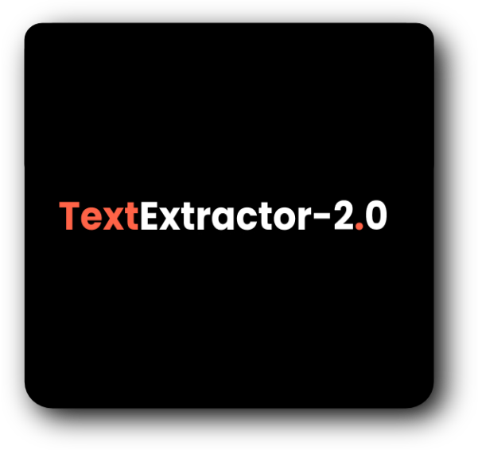

<p align="center">
 
 </p>
This webApp extracts text from an image :heart_eyes:
<div align="center">

[](https://wakatime.com/badge/github/Aman-zishan/DocScanner)
[](https://travis-ci.com/Aman-zishan/DocScanner)
[](https://GitHub.com/Aman-zishan/DocScanner/issues/)
[](https://github.com/Aman-zishan/DocScanner/issues)
[](https://github.com/Aman-zishan/DocScanner/blob/master/LICENSE)
[](http://hits.dwyl.com/Aman-zishan/DocScanner)

</div>

<h3> Tech stack used: :octocat: </h3>

<li>Visual Code Studio</li>
<li>python:snake:</li>
<li>flask:hot_pepper:</li>


<h3>Installation :gem: </h3>

1. **:round_pushpin: clone the repository.**

   ```shell
   $git clone https://github.com/Aman-zishan/textextractor2.0.git

   ```
2. **:checkered_flag: navigate to downloaded folder.**

   ```shell
   $cd textextractor2.0

   ```
3. **:construction: set up virtual environment.**

   ```shell
   #windows
   
   $py -3 -m venv venv
   
   #linux/mac OS
   
   $python3 -m venv venv

   ```
4. **:diamonds: activate virtual environment.**

   ```shell
   #windows

   $venv\Scripts\activate
   
   #linux/mac OS
   
   $source venv/bin/activate

   ```
5. **:hot_pepper: install flask & other required dependencies**
    ```shell
    
    #windows
    

   $pip install -r requirements.txt
   
   #linux/mac OS
   
  
   $pip3 install -r requirements.txt

   ```
6. **:dart: setup flask environment and run app**
    ```shell
    
   $export FLASK_APP=app.py
   $export FLASK_ENV=development
   $flask run
   ```
 # Demo :blush:
   <p align="center">
 
 
 
 </p>
 


